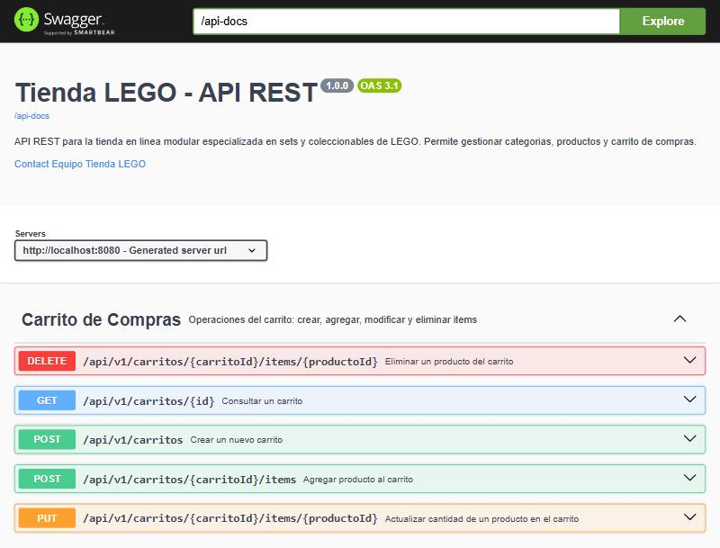
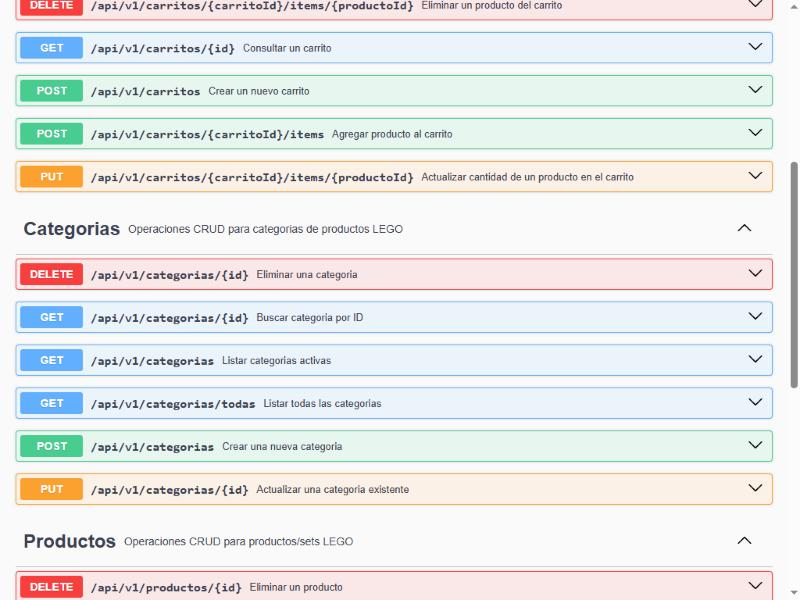
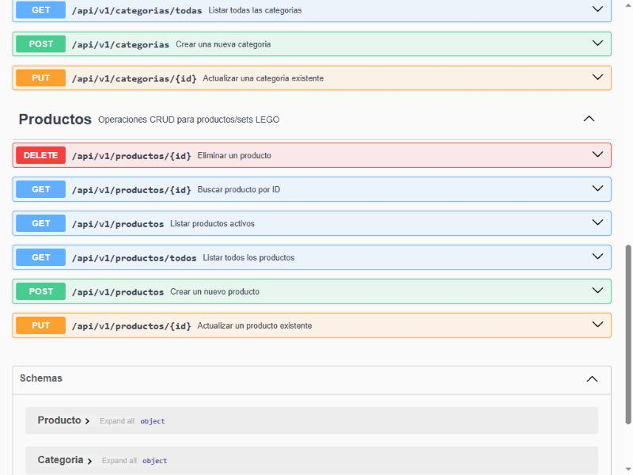

# Tienda en Linea Modular - LEGO

Aplicacion web de comercio electronico especializada en sets y coleccionables de LEGO.
Backend REST API + Frontend independiente (arquitectura desacoplada).

**Proyecto de Aula** — Ingenieria de Sistemas, 2026.

## Endpoints principales

### Categorias (`/api/v1/categorias`)

| Metodo | Ruta | Descripcion |
|--------|------|-------------|
| GET | `/api/v1/categorias` | Listar categorias activas |
| GET | `/api/v1/categorias/todas` | Listar todas (admin) |
| GET | `/api/v1/categorias/{id}` | Buscar por ID |
| POST | `/api/v1/categorias` | Crear categoria |
| PUT | `/api/v1/categorias/{id}` | Actualizar categoria |
| DELETE | `/api/v1/categorias/{id}` | Eliminar categoria |

### Productos (`/api/v1/productos`)

| Metodo | Ruta | Descripcion |
|--------|------|-------------|
| GET | `/api/v1/productos` | Listar activos (filtro opcional `?categoriaId=`) |
| GET | `/api/v1/productos/todos` | Listar todos (admin) |
| GET | `/api/v1/productos/{id}` | Buscar por ID |
| POST | `/api/v1/productos` | Crear producto |
| PUT | `/api/v1/productos/{id}` | Actualizar producto |
| DELETE | `/api/v1/productos/{id}` | Eliminar producto |

### Carrito de Compras (`/api/v1/carritos`)

| Metodo | Ruta | Descripcion |
|--------|------|-------------|
| POST | `/api/v1/carritos` | Crear carrito |
| GET | `/api/v1/carritos/{id}` | Consultar carrito |
| POST | `/api/v1/carritos/{id}/items?productoId=&cantidad=` | Agregar producto |
| PUT | `/api/v1/carritos/{id}/items/{productoId}?cantidad=` | Cambiar cantidad |
| DELETE | `/api/v1/carritos/{id}/items/{productoId}` | Quitar producto |

## Stack tecnologico

- **Backend:** Java 21 + Spring Boot 4.0.2
- **Base de datos:** MongoDB 8
- **Documentacion API:** OpenAPI 3.1 / Swagger UI (springdoc-openapi)
- **Contenedores:** Docker Compose

## Evidencias Swagger





## Modelo de datos

```
Categoria (1) -----> (0..*) Producto
Carrito   (1) -----> (0..*) ItemCarrito ---> Producto
```

| Entidad | Campos |
|---------|--------|
| Categoria | id, nombre, descripcion, activa |
| Producto | id, nombre, numeroSet, descripcion, precio, stock, imagenUrl, activo, categoriaId |
| Carrito | id, fechaCreacion, estado, total, items[] |
| ItemCarrito | productoId, productoNombre, cantidad, precioUnitario, subtotal |
